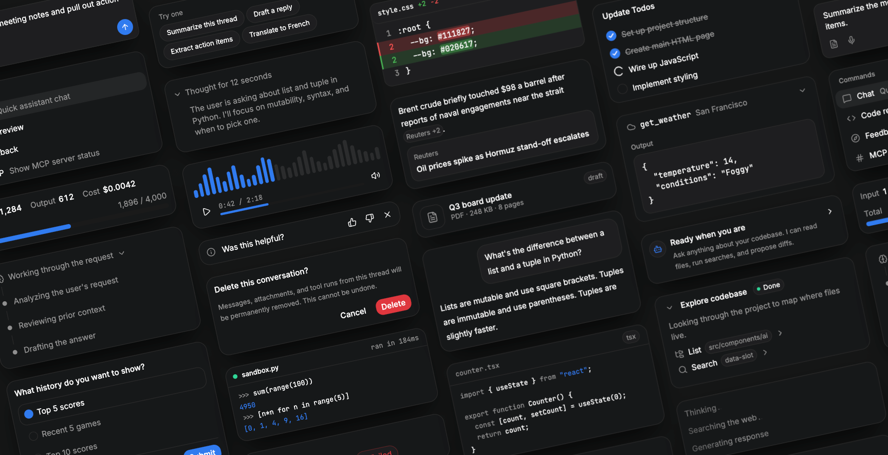

# About

React components for building AI chat interfaces. Messages, streaming, prompt, reasoning blocks, tool calls, citations, and the rest of the pieces a modern AI app needs.

Each component is a thin, themeable wrapper you own. Drop the source into your project, restyle with tokens or Tailwind, and compose freely.



## Documentation

Full docs, live demos, and copy-paste source at [ai.nauv.al](https://ai.nauv.al).

## Local development

```bash
bun install
bun --bun run dev
```

The playground runs on port 3300.
